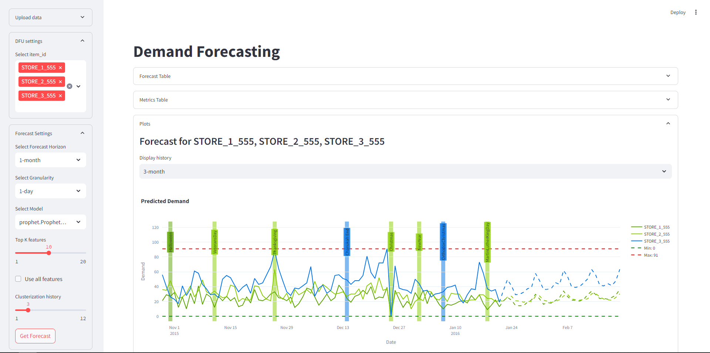
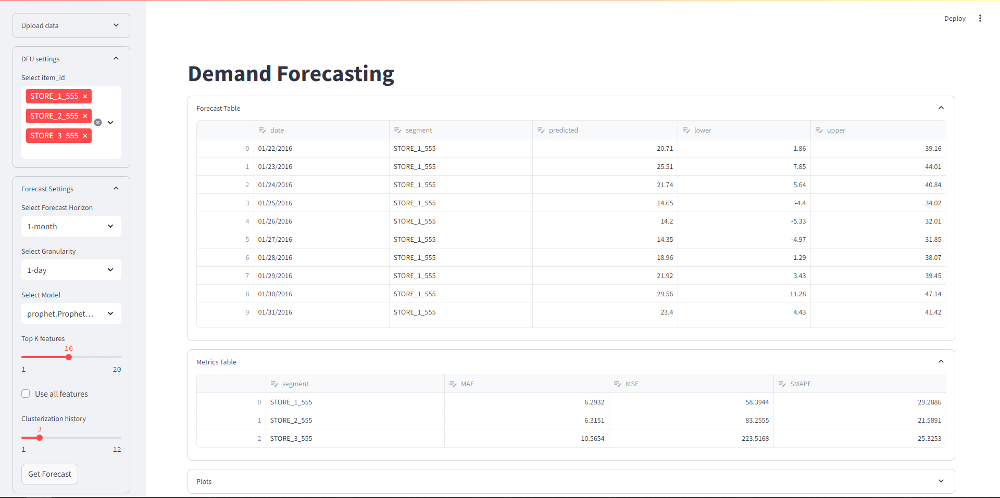
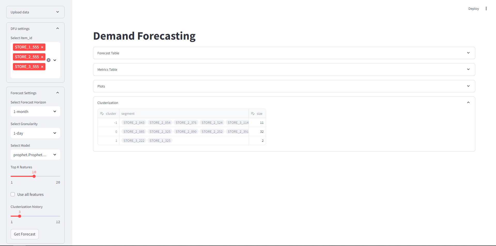

# Forecast AI &middot;    
> Additional information or tag line

A brief description of your project, what it is used for.

# Automated Demand Forecasting

## Web Page

Follow [link](http://89.169.165.189:8501/) to connect to web service. **Please, do not connect from multiple users. It's just 3 Docker containers**

## Setup

To setup service, you need Docker and Docker Compose installed. To setup, run:

    docker compose build
    docker compose up -d

## Use

### 1. Select data format. 
`standard` means the data in `train` format (`train` data is preloaded). If chosen, default data preprocessing pipeline will run. If not, provide data in a single CSV file

### 2. Select DFU settings

If data is `standard`, you only need to choose one or multiple `item_id` for further forecast. If not select following parameters:

    1. Target name: Name of target column for forecast
    2. Date name: Name of column containing dates for time-series forecast
    3. ID name: Name of ID column
    4. ID names: Names of SKUs to forecast (>= 1)

### 3. Select forecast settings

Select following forecast settings:

    1. Horizon: Choose forecast horizon: 1-day, 1-week, 1-month
    2. Granularity: Choose forecast granularity, i.e. 1-week means that data will be aggregated (sum) on weekly basis
    3. Model: Choose model for forecast. In future, option "Auto" will be added to select AutoML pipeline. By default - ProphetModel
    4. Top K features: Choose number of features to select during feature-selection step. Set "Use all features" if no feature-selection is needed. By default - 10
    5. Metric: [deprecated]
    6. Clustering history: Choose number on months for clusterization of data. By default - 3

    You're set up for forecasting. It usually takes about a minute.

### 4. Example 1. Standard dataset

    Forecast Plots

    Tables with forecast and metric. You can edit forecast on your need and download resulting table (upper right corner of table)

    Table with clusterization results
    

